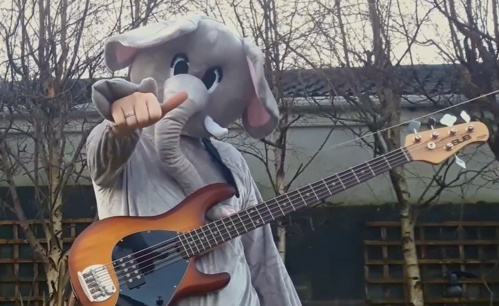

-----------------

**Teaching**

For a list of courses I am currently teaching, see my [personal page at the Maynooth University website](https://www.maynoothuniversity.ie/faculty-science-engineering/our-people/rafael-de-andrade-moral#Teaching).

Courses I have taught at 3rd level (Maynooth University and University of São Paulo):

* ST662 Topics in Data Analytics
* Time Series
* Statistical Methods for Data Science
* R for Statistics and Data Science
* Statistical Machine Learning
* Introduction to Data Science
* Introduction to Statistics
* Probability
* Statistical Computing with R

Short courses I have taught:

* Statistical Modelling Applied to Entomology Using R: A Practical Course on Generalized Linear Mixed Models
* Introduction to Design and Analysis of Experiments
* Introduction to Diversity-Interactions Models
* Topics in Machine Learning
* From Statistics to Data Science
* A ggplot2 tutorial and case study
* Image classification
* Topics in Data Science
* Experimental design
* Generalized linear models
* Introduction to R
* Biostatistics using R

-----------------

**Statistics Parodies**

During the COVID-19 pandemic, I started writing parodies of famous songs to teach Statistics to undergraduate students.

You can access the 10-song suite I call the _Summary Song Saga_ in this [playlist](https://www.youtube.com/watch?v=lm53uqt-ln0&list=PLZ0e2Vq6gAWLTI8X_rzFgF59uEXFfbSrM). It includes:

| Song                      | Original                            |
|---------------------------|-------------------------------------|
| [The Probability Song](https://youtu.be/lm53uqt-ln0)      | Bad Guy, by Billie Eilish           |
| [Discrete Random Variables](https://youtu.be/ZINXFoQMZVs) | Someone You Loved, by Lewis Capaldi |
| [Savage Stats](https://youtu.be/Cy07eubC-jI)              | Savage Love, by Jason DeRulo        |
| [S.O.S. P-value](https://youtu.be/HTdo6xjfFHI)            | S.O.S., by Avicii                   |
| [CI Hammer](https://youtu.be/sOFlR4C5YVs)                 | Square Hammer, by Ghost             |
| [Tidy Verse](https://youtu.be/p8Py9C8iq2s)                | Paradise, by Coldplay               |
| [Correlation Sugar](https://youtu.be/D5hxMQNHyfc)         | Watermelon Sugar, by Harry Styles   |
| [Simpson's Paradox](https://youtu.be/nGqzoqXZch0)         | Blinding Lights, by The Weeknd      |
| [Overfitting](https://youtu.be/pZTLFu79UbY)               | Attention, by Charlie Puth          |
| [The ROCk Curve](https://youtu.be/Ae46DDN2K0A)            | The Pretender, by Foo Fighters      |

I have also produced other music videos exploring the effects of [Imposter Syndrome](https://youtu.be/79fUgObOmjU) ('Bad Reviews', a parody of Bad Habits by Ed Sheeran) and [what you should not do in R](https://youtu.be/nziSP3vELCk) ('The R Inferno Song', a parody of Teenage Dirtbag by Wheatus).

You can also find other short songs and videos in my [Twitter](https://twitter.com/rafamoral) and [TikTok](https://www.tiktok.com/@rafa_moral) pages.

I was honoured to receive the [Maths Week Ireland Award](https://www.mathsweek.ie/2022/award-public-awareness-of-maths/) for this initiative.

I also produced videos to explain statistical concepts associated with epidemiology as part of the SciComm initiative by the Department of Health (see the articles published by the [Irish Times](https://www.irishtimes.com/news/health/i-decided-to-sing-about-the-pandemic-people-seemed-to-like-it-1.4795068) and [Irish Independent](https://www.independent.ie/irish-news/irelands-tiktok-scientists-describe-trolling-and-misinformation-as-they-took-part-in-government-covid-campaign-41318812.html)).

